# 🌟 Welcome to My Digital Universe! 🌟

  

  

---

## 🚀 About Me

🔭 **Currently Building:** **CognitoPics** - A privacy-focused smart photo gallery with face recognition technology that automatically detects and securely hides photos containing selected faces. Features an interactive UI and password-protected storage for the ultimate photo privacy experience!

👯 **Open to Collaborate on:** Machine Learning projects, Full-stack web development, and AI for social impact initiatives. I'm passionate about creating technology that solves real-world problems and makes a meaningful difference.

🌱 **Currently Learning:** 
- ☁️ AWS Cloud Architecture
- 🐧 Red Hat Linux Administration  
- 🔒 Cybersecurity Fundamentals

💬 **About Me:** Computer Science undergrad at KIIT University (Class of 2026). I'm passionate about turning innovative ideas into real-world applications - from securing private memories with face recognition to building cloud-based expense trackers (while trying not to overspend on coffee ☕).

⚡ **Fun Fact:** When I'm not immersed in code, you'll find me crafting graphics or strategically planning my next chess move! ♟️

---

## 🌐 Connect With Me

  

---

## 💻 Tech Arsenal

### 🔥 Languages & Frameworks

### ☁️ Cloud & DevOps

### 🌐 Web Development

### 🤖 AI & Machine Learning

### 🗄️ Databases

---

## 📊 GitHub Analytics

  

  
  

  

---

## 🏆 GitHub Trophies

  

---

## 🚀 Featured Projects

  

### 🔐 **CognitoPics**

🎯 **Face-based photo locker** that intelligently detects and encrypts images containing selected faces  
🔒 Implemented **secure encryption algorithms** for ultimate privacy protection of personal photos  
💡 Inspired by Google Photos Locked folder system with an innovative twist - **detects persons and hides all their photos at once** *(work in progress)*

---

### 💰 **Expense Tracker**

☁️ Built **serverless expense tracking application** with smart categorization and real-time management  
📊 **Visualized spending patterns** leveraging AWS's scalable and cost-effective architecture  
⚡ Fully serverless design ensuring optimal performance and minimal costs

---

### ❤️ **Heart Disease Prediction**

🤖 Trained multiple **ML models** (Logistic Regression, KNN, Random Forest) using clinical datasets  
🎯 **Enhanced accuracy** through advanced feature engineering and cross-validation techniques  
🏥 Predictive healthcare solution for early disease detection

---

### 🎪 **KEVENTS (Event Schedules)**

🏛️ Designed **robust platform** supporting **1,000+ users** with optimized scheduling system  
📅 Helps students track timelines of events scheduled by various **societies and clubs** on college campus  
⚡ High-performance architecture handling concurrent user loads efficiently

  

---

## 🎯 Current Focus

```mermaid
graph TD
    A[🎓 Learning Phase] --> B[☁️ AWS Cloud Architecture]
    A --> C[🐧 Red Hat Linux]
    A --> D[🔒 Cybersecurity]
    
    E[🚀 Building Phase] --> F[📸 CognitoPics - Privacy AI]
    E --> G[🌐 Full-Stack Projects]
    E --> H[🤖 ML Applications]
    
    I[🤝 Collaboration] --> J[🌍 AI for Social Impact]
    I --> K[💻 Open Source]
    I --> L[🎨 Creative Tech]
```

  

---

   
  **Thanks for visiting! Let's build something amazing together! 🚀**

---

  ✨ Generated with passion and lots of coffee ☕ | Feel free to ⭠my repositories if you find them interesting!

